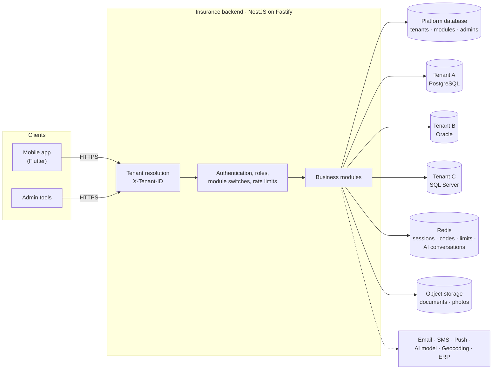
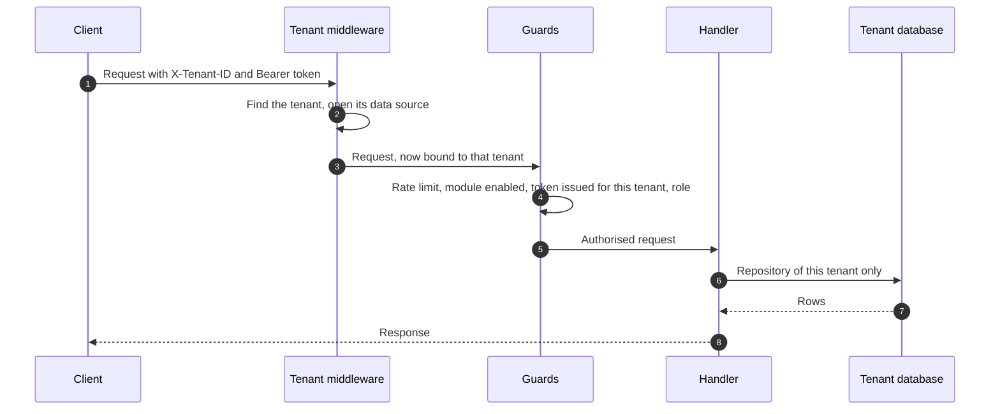
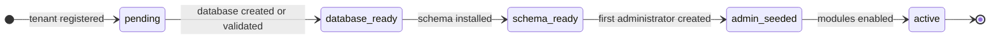

<div align="center">

# Insurance Platform

**One backend for many insurers.**<br/>
Each insurer gets its own database, on the engine it already runs, its own set of modules, and its own branding.<br/>
One deployment serves them all.

<br/>

[](https://github.com/Insurance-SaaS/Insurance-app-Saas/actions/workflows/backend-ci.yml)
[](https://github.com/Insurance-SaaS/Insurance-app-Saas/actions/workflows/backend-db-matrix.yml)


[Quick start](#quick-start) ·
[Architecture](#architecture) ·
[Modules](#modules) ·
[API](#api-at-a-glance) ·
[Security](#security-model) ·
[Testing](#testing-and-quality) ·
[Deployment](#deployment) ·
[Documentation](#documentation)

</div>

---

## What this is

A multi-tenant API that an insurance company's mobile app talks to: policyholders sign up, declare claims with photos, compare quotes, pay, find a branch, get notified, and can do most of that by chatting with an AI assistant in French, English or Arabic.

The platform operator onboards each insurer as a **tenant**. A tenant is isolated at the database level, chooses which modules it uses, and can define its own extra fields on claims. The mobile app is the same for everyone; it asks the backend which tenant it is serving and adapts.

## Highlights

| | |
|---|---|
| **A database per insurer** | No shared tables between tenants. A request can only reach the database of the tenant it names, and fails if it names none. |
| **Any of five engines, mixed** | PostgreSQL, MySQL, MariaDB, Oracle and SQL Server, for the platform and for each tenant independently. One running backend can serve a tenant on Oracle next to one on PostgreSQL. |
| **Modules per tenant** | Claims, quotes, payments, branches, notifications, AI assistant and ERP bridge are switched on or off per insurer, with their dependencies checked. |
| **Secure by default** | Every route needs a token unless explicitly marked public. Platform administrators are separate accounts with a separate signing secret. |
| **Onboarding in one request** | Database, schema, first administrator and modules, in a sequence that can be repeated safely if it stops half-way. |
| **Conversational claims and quotes** | An assistant that collects a claim step by step, analyses damage photos and files the claim once, in three languages. |
| **Operable** | Startup configuration check, readiness endpoint, rate limits shared across instances, migrations as a deployment step, a small production image. |

## Contents

- [Architecture](#architecture)
- [Modules](#modules)
- [Quick start](#quick-start)
- [Configuration](#configuration)
- [API at a glance](#api-at-a-glance)
- [Security model](#security-model)
- [Databases and migrations](#databases-and-migrations)
- [AI assistant](#ai-assistant)
- [Testing and quality](#testing-and-quality)
- [Deployment](#deployment)
- [Repository layout](#repository-layout)
- [Documentation](#documentation)
- [Project status](#project-status)
- [Contributing](#contributing)
- [Licence](#licence)

---

## Architecture



Two kinds of database:

- The **platform database** is the control plane: the registry of tenants with their (encrypted) connection details, which modules each has enabled, platform administrators, custom-field definitions and the audit log.
- A **tenant database** holds one insurer's business data: users, claims and documents, quotes and products, payments, branches, notifications.

### What happens to a request



The tenant travels with the request in an async context, not in function arguments. Code obtains repositories from a factory that reads that context and **throws when there is no tenant**; there is no default database to fall back on.

### Onboarding a tenant



Each step records its completion. If onboarding stops (database unreachable, missing privilege), sending the same request again resumes after the last completed step. The tenant only becomes active at the end.

Two ways to give a tenant its database:

| Mode | Who creates the database | Engines |
|---|---|---|
| **Managed** | The platform, as `tenant_<slug>` on its own server | PostgreSQL, MySQL, MariaDB, SQL Server |
| **Bring your own** | The insurer supplies an empty database; the connection is checked before anything is recorded | All five, and the only mode for Oracle |

---

## Modules

Every business module can be enabled or disabled per tenant. A disabled module's routes answer `403` for that tenant.

| Module | Id | What it does | Needs |
|---|---|---|---|
| **Claims** | `@insurance/claims` | Declare a claim with photos and PDF documents, follow its status, admin review and expert assignment | |
| **Quotes** | `@insurance/quotes` | Product catalogue, quotes with coverage details, recommendation by age, budget and product | |
| **Payment** | `@insurance/payment` | Records and tracks payment transactions with a strict status lifecycle and retry-safe creation. No payment gateway is connected yet | |
| **Branches** | `@insurance/branches` | Directory of agencies and contacts, for the app's map and locator | |
| **Notifications** | `@insurance/notifications` | Push notifications through Firebase, with history and per-device tokens | |
| **AI assistant** | `@insurance/ai` | Conversation that files claims and recommends quotes, with photo analysis | Claims, Quotes |
| **ERP bridge** | `@insurance/erp` | Links a user to an account in the insurer's core system and creates contracts from quotes | Quotes |

Always available: authentication and profiles, user administration, tenant configuration, custom fields, translation, activity logs.

**Custom fields.** A platform administrator can define extra fields per tenant (text, number, boolean, date, choice, with length, range and pattern rules). They are validated on every claim declaration, so an insurer can ask for its own data without a code change.

---

## Quick start

**Prerequisites:** Node.js 20, Docker (for the services below and for the integration tests).

<details>
<summary><b>Start PostgreSQL, Redis and object storage locally</b></summary>

```bash
docker run -d --name ins-postgres -p 5432:5432 \
  -e POSTGRES_PASSWORD=postgres -e POSTGRES_DB=insurance_platform postgres:16-alpine

docker run -d --name ins-redis -p 6379:6379 redis:7-alpine

docker run -d --name ins-minio -p 9000:9000 -p 9001:9001 \
  -e MINIO_ROOT_USER=minioadmin -e MINIO_ROOT_PASSWORD=minioadmin \
  minio/minio server /data --console-address ":9001"
```

Buckets are created on first upload.

</details>

```bash
git clone git@github.com:Insurance-SaaS/Insurance-app-Saas.git
cd Insurance-app-Saas/insurance-backend

npm ci
cp .env.example .env                 # fill in the values; every line is commented

npm run migrate -- platform          # creates the platform schema
npm run platform-admin -- create you@example.com "Your Name"   # asks for a password

npm run start:dev
```

The API is at `http://localhost:3000/api/v1`, with interactive documentation at `http://localhost:3000/api` (not served in production).

The application checks its configuration when it starts. If something required is missing or malformed it stops and lists everything at once; optional integrations that are not configured are reported as switched off.

### Your first tenant

```bash
# 1. Sign in as the platform administrator
curl -s http://localhost:3000/api/v1/platform/admin-auth/login \
  -H 'content-type: application/json' \
  -d '{"email":"you@example.com","password":"<your password>"}'
# -> { "accessToken": "...", "refreshToken": "..." }

# 2. Onboard an insurer: database, schema, first administrator and modules
curl -s http://localhost:3000/api/v1/platform/tenants/onboard \
  -H 'content-type: application/json' \
  -H 'authorization: Bearer <accessToken>' \
  -d '{
        "tenant":      { "slug": "acme", "name": "Acme Insurance" },
        "tenantAdmin": { "username": "acme_admin", "email": "admin@acme.test", "password": "ChangeMe123" }
      }'
# -> { "status": "active", "schema": { "version": "...", "drift": 0 }, "enabledComponents": [...] }

# 3. What the mobile app asks first
curl -s http://localhost:3000/api/v1/tenant/config -H 'x-tenant-id: acme'
# -> name, branding, enabled modules, languages, custom fields
```

From here, every tenant request carries `X-Tenant-ID: acme`. The sign-up, login and claim flows are described step by step in the [Flutter integration guide](docs/FLUTTER_INTEGRATION_GUIDE.md).

---

## Configuration

Everything is set through environment variables; [`insurance-backend/.env.example`](insurance-backend/.env.example) lists them all with comments.

| Variable | Purpose | Required |
|---|---|---|
| `DB_TYPE`, `DB_HOST`, `DB_PORT`, `DB_USER`, `DB_PASSWORD`, `DB_NAME` | Platform database. `DB_TYPE` is `postgres`, `mysql`, `mariadb`, `oracle` or `mssql` | Yes |
| `REDIS_HOST`, `REDIS_PORT`, `REDIS_PASSWORD`, `REDIS_TLS` | Sessions, one-time codes, rate limits, AI conversations | Yes |
| `JWT_SECRET_KEY`, `JWT_SECRET_KEY_REFRESH`, `JWT_PLATFORM_SECRET` | Token signing. Three different values, at least 32 characters in production | Yes |
| `TENANT_DB_ENCRYPTION_KEY` | Encrypts tenants' database passwords at rest. 64 hexadecimal characters. Back it up | Yes |
| `MINIO_ENDPOINT`, `MINIO_PORT`, `MINIO_ACCESS_KEY`, `MINIO_SECRET_KEY` | Object storage for documents and photos | In production |
| `EMAIL_HOST`, `EMAIL_PORT`, `EMAIL_USER`, `EMAIL_PASS` | Sign-up and password-reset codes are sent by email | In production |
| `TRUST_PROXY`, `CORS_ORIGINS` | Number of reverse proxies in front; browser origins allowed | Behind a proxy / for web clients |

<details>
<summary><b>Optional integrations and tuning</b></summary>

| Variable | Effect when set |
|---|---|
| `OPENAI_API_KEY`, `OPENAI_BASE_URL`, `OPENAI_MODEL` | Enables the AI assistant with any OpenAI-compatible provider (default model `gpt-4o`) |
| `AI_DAILY_MESSAGES_PER_USER`, `AI_DAILY_MESSAGES_PER_TENANT` | Daily assistant limits (defaults 200 and 10,000); a tenant can override them |
| `INFOBIP_API_KEY`, `INFOBIP_BASE_URL`, `INFOBIP_SENDER_ID` | SMS codes |
| `FIREBASE_SERVICE_ACCOUNT_PATH` or `FIREBASE_SERVICE_ACCOUNT` | Push notifications |
| `GOOGLE_CLIENT_ID`, `GOOGLE_CLIENT_SECRET`, `GOOGLE_CALLBACK_URL`, `GOOGLE_WEB_CLIENT_ID`, `GOOGLE_ANDROID_CLIENT_ID` | Google sign-in |
| `GOOGLE_MAPS_API_KEY` | Address checks with Google; OpenStreetMap is used otherwise |
| `DEFAULT_TIMEZONE` | Time zone for "today" when a tenant sets none, for example `Africa/Algiers` |
| `UPLOAD_MAX_FILE_MB`, `BODY_LIMIT_BYTES` | Upload size (default 15 MB) and JSON body size (default 1 MB) |
| `DB_POOL_SIZE`, `TENANT_DB_POOL_SIZE`, `TENANT_DS_IDLE_MS` | Connection pools, and how long an unused tenant pool stays open |
| `DB_AUTO_MIGRATE` | Set up or upgrade the platform schema at startup. Convenient locally; off in production |
| `LOG_LEVEL` | `error`, `warn`, `log`, `debug` or `verbose` |

</details>

---

## API at a glance

| | |
|---|---|
| Base URL | `/api/v1` |
| Tenant | `X-Tenant-ID: <slug>` on every tenant route (lower-case slug) |
| Authentication | `Authorization: Bearer <accessToken>` |
| Language | `?lang=fr`, or `Accept-Language`; English, French and Arabic |
| Lists | `?page=1&limit=50` (limit up to 100) |
| Uploads | `multipart/form-data`; JPG, PNG, WEBP, and PDF for claim documents; type detected from content |

<details>
<summary><b>Route groups</b> (about 130 routes)</summary>

| Prefix | Routes | Area | Module switch |
|---|---|---|---|
| `/auth` | 23 | Sign-up with email and SMS codes, login, token refresh, password reset and change, profile, photo, Google sign-in, account deletion | |
| `/users` | 9 | User administration, profile photo | |
| `/claims` | 6 | Declare, list, read, admin status change and deletion, address check | `@insurance/claims` |
| `/quotes` | 10 | Products, quotes, recommendation, comparison, admin management | `@insurance/quotes` |
| `/payments` | 6 | Create, read, list, admin status change | `@insurance/payment` |
| `/branches`, `/contacts` | 15 | Agencies and contacts | `@insurance/branches` |
| `/notifications` | 12 | Device tokens, history, sending | `@insurance/notifications` |
| `/ai` | 11 | Chat, chat with photos, photo analysis, conversation state, usage | `@insurance/ai` |
| `/erp/mappings`, `/contract` | 10 | Account mappings, contracts | `@insurance/erp` |
| `/tenant/config` | 1 | Branding, enabled modules, languages, custom fields | |
| `/custom-fields`, `/translation`, `/logs` | 8 | Custom-field definitions for the app, translation, activity logs | |
| `/platform/admin-auth` | 3 | Platform administrator login, refresh, logout | Platform |
| `/platform/tenants` | 15 | Tenants, onboarding, modules, schema status, migrations, custom fields | Platform |
| `/health`, `/health/ready` | 2 | Liveness and readiness (no prefix, no token, no tenant) | |

</details>

Errors have one shape everywhere:

```json
{
  "statusCode": 400,
  "message": ["dateIncident must be a valid ISO 8601 date string (e.g., YYYY-MM-DD)"],
  "path": "/api/v1/claims/declare",
  "method": "POST",
  "timestamp": "2026-10-04T10:15:00.000Z",
  "requestId": "3f6c1a52-…"
}
```

`message` is a string, or a list when several fields are wrong. Errors a client may want to tell apart also carry a `code`, for example `AI_DAILY_LIMIT_REACHED`.

A machine-readable listing for client developers is in [`insurance-backend/docs/api-integration.json`](insurance-backend/docs/api-integration.json).

---

## Security model

**Tenancy**

- A tenant route without `X-Tenant-ID` is refused. Data access goes through one factory that has no database to offer outside a tenant request.
- A token is only valid against the tenant it was issued for; a token of tenant A sent with tenant B's header is rejected.
- Tenants' database passwords are stored encrypted (AES-256-GCM) and are never returned by the API.
- Cache keys, one-time codes and stored files are all namespaced by tenant.

**Authentication and roles**

- Every route requires a token unless it is explicitly marked public. A test lists all routes and fails if one becomes reachable without a token by accident.
- Access tokens last 15 minutes. Refresh tokens last 7 days, work once (they are rotated), and are revoked by a password change or reset.
- Two roles inside a tenant: `user` and `tenant_admin`. A user can only read their own claims, payments and mappings; someone else's answers `404`, not `403`.
- **Platform administrators** are separate accounts, in the platform database, with tokens signed by a separate secret. No tenant account, whatever its role, is accepted on `/platform/*`. They are managed from the command line only.

**Accounts**

- Passwords are hashed with Argon2 and never leave the database layer.
- Sign-up requires a verified email code. Codes expire after 15 minutes, work once, and are discarded after 5 wrong attempts.
- Password reset needs a single-use token obtained with the emailed code. Responses do not reveal whether an email is registered.

**Input and transport**

- Strict request validation: unknown fields are rejected, not ignored.
- Uploads are accepted by their content, not their name, with limits enforced while the upload is still being read.
- Security headers, a CORS allowlist, a 1 MB limit on JSON bodies, and rate limits counted in Redis so they hold across instances (stricter on login and code routes).
- Patterns in tenant-defined custom fields are checked so they cannot stall the server.
- Secrets are scanned for in CI, and before each commit once the repository's pre-commit hook is enabled.

---

## Databases and migrations

| Engine | Platform database | Tenant database | Verified |
|---|---|---|---|
| PostgreSQL | Yes | Managed or own | Every change, against a real server |
| MariaDB | Yes | Managed or own | Every change, against a real server |
| MySQL | Yes | Managed or own | Database matrix workflow |
| SQL Server | Yes | Managed or own | Database matrix workflow |
| Oracle | Yes | Own database | Database matrix workflow |

How one codebase runs on all of them:

- **Portable entities.** Entities are declared with a small set of column helpers that every driver maps to its own types. A test builds the schema metadata for all five engines and fails on any engine-specific type.
- **One dialect per engine** holds the few things that really differ: connection options, how to create a database, how a unique-constraint violation is reported.
- **Engine-neutral migrations.** Migrations describe changes in terms of the entities, check before they act, and can be re-run after a partial failure, which matters on engines that cannot roll back schema changes.
- **Drift detection.** The schema of any database can be compared with what the code expects; the integration tests require the difference to be empty on each engine, including after reverting to the baseline and migrating forward again.

```bash
npm run migrate -- platform         # set up or upgrade the platform database
npm run migrate -- tenants          # upgrade every active tenant (or name some: tenants acme other)
npm run migrate -- status           # versions and any drift; changes nothing
```

New tenant databases are created directly from the entities and stamped with the newest migration; existing ones run what is pending. Two runs can never migrate the same tenant at once.

---

## AI assistant

A conversation, not a form: the user says what happened, the assistant asks for what is missing, validates dates and places, reads the damage from photos, shows a summary and, once the user confirms, files the claim. It also guides a quote request and recommends offers.

- Works with any OpenAI-compatible provider; without a key the rest of the platform runs normally and the assistant answers that it is unavailable.
- French, English and Arabic, detected from the message.
- Conversations are kept in Redis with an expiry, keyed by tenant and user, so any instance can continue one and nobody can read another user's.
- A claim is filed once per conversation, even if the confirmation is repeated.
- Bounded cost: message length, photos per message, and daily limits per user and per tenant.
- Provider failures surface as errors with a code (`RATE_LIMIT_EXCEEDED`, `MODEL_UNAVAILABLE`, `TIMEOUT_ERROR`, …) instead of an apologetic chat message.

---

## Testing and quality

```bash
cd insurance-backend

npm run lint:check        # ESLint, errors only
npm run typecheck
npm test                  # unit tests
npm run test:e2e          # integration tests; starts PostgreSQL, MariaDB and Redis in Docker
npm run test:cov:all      # both, with coverage reports
npm run lint:sonar        # SonarSource's TypeScript rules, locally
```

| | |
|---|---|
| **Unit tests** | About 200, next to the code they test |
| **Integration tests** | About 200, against the real application: the same pipeline as production, real databases, with only the outside world (email, SMS, storage, AI model, geocoder) replaced |
| **Two engines at once** | The two test tenants live on different engines, so every run proves the mixed case. Choose others with `TEST_PLATFORM_ENGINE` and `TEST_SECOND_ENGINE` |
| **What they cover** | Authentication and account-takeover paths, tenant isolation, ownership of every resource, module switches, onboarding and its resumption, migrations up and down on each engine, claims with documents, payments, a scripted AI claim conversation |

**Continuous integration**

| Workflow | Runs |
|---|---|
| [`backend-ci`](.github/workflows/backend-ci.yml) | Secret scan, lint, typecheck, unit tests, integration tests, and a build of the production image that must start and run unprivileged |
| [`backend-db-matrix`](.github/workflows/backend-db-matrix.yml) | The integration suite on six pairings of the five engines |

**Static analysis.** SonarQube, 4 October 2026: 0 bugs, 0 vulnerabilities, 0 security hotspots, 1.2% duplication. Four maintainability findings remain, all long functions in the AI assistant. Line coverage from both test suites is about 60%; the thinnest areas are quotes, push notifications and the storage client. How to run an analysis is described in the [backend README](insurance-backend/README.md#static-analysis-with-sonarqube).

---

## Deployment

```bash
cd insurance-backend
docker build -t insurance-backend .

# On every deployment, before the new version takes traffic
docker run --env-file production.env insurance-backend node dist/cli/migrate.js platform
docker run --env-file production.env insurance-backend node dist/cli/migrate.js tenants

docker run -p 3000:3000 --env-file production.env insurance-backend
```

- The image holds the compiled code and production dependencies only, and runs as an unprivileged user.
- `GET /health` answers while the process is up. `GET /health/ready` answers `200` only while the platform database and Redis respond; point the load balancer at it.
- Several instances can run side by side: sessions, codes, rate limits and AI conversations live in Redis.
- [`fly.toml`](insurance-backend/fly.toml) deploys to Fly.io and runs both migration commands as a release step.

The full procedure, including secrets, upgrades, rollback and what to monitor, is in the [go-live runbook](insurance-backend/GO_LIVE_RUNBOOK.md).

---

## Repository layout

```text
Insurance-app-Saas/
├── insurance-backend/            The API
│   ├── src/
│   │   ├── core/                 Tenancy, per-tenant data sources, dialects, schema,
│   │   │                         module registry, platform administrators, custom fields
│   │   ├── auth/                 Tenant users: sign-up, codes, login, tokens, roles
│   │   ├── modules/              claims · quotes · payment · branches · notifications ·
│   │   │                         users · ai · logging
│   │   ├── integrations/         ERP, email, SMS
│   │   ├── cache_storage/        Redis, cache, one-time codes, object storage
│   │   ├── database/migrations/  Platform and tenant migrations
│   │   ├── cli/                  migrate, platform-admin
│   │   └── shared/               Filters, interceptors, upload reader, validation, utilities
│   ├── test/                     Integration tests and their harness
│   ├── Dockerfile · fly.toml
│   ├── GO_LIVE_RUNBOOK.md
│   └── README.md                 Developer reference for the backend
├── packages/plugin-sdk/          SDK for external modules (experimental, not loaded)
├── docs/                         Guides for app and backend developers
└── .github/workflows/            CI, database matrix
```

---

## Documentation

| Document | For | Contents |
|---|---|---|
| [Backend README](insurance-backend/README.md) | Backend developers | Commands, code organisation, rules the code relies on, changing the schema, static analysis |
| [Backend application guide](docs/BACKEND_APP_GUIDE.md) | Integrators | Setup, tenant onboarding, authentication flow, using each module |
| [Flutter integration guide](docs/FLUTTER_INTEGRATION_GUIDE.md) | Mobile developers | Client setup, every flow with code, and the table of recent API changes |
| [Go-live runbook](insurance-backend/GO_LIVE_RUNBOOK.md) | Operators | First deployment, upgrades, rollback, routine operations, what to watch |
| [API listing](insurance-backend/docs/api-integration.json) | Client developers | Routes with their bodies, in JSON |
| [Plugin authoring guide](packages/plugin-sdk/PLUGIN_AUTHORING_GUIDE.md) | Future module authors | The external-module SDK and what must be done before it is switched back on |
| [ERP integration notes](erp-integration.txt) | Integrators | The endpoints expected from an insurer's core system (in French) |

---

## Project status

**Pre-launch.** The API may still change and no production tenant exists yet. The table of changes at the top of the [Flutter guide](docs/FLUTTER_INTEGRATION_GUIDE.md) is kept current.

Known gaps, in the order they matter:

- **Engines in CI.** PostgreSQL and MariaDB are exercised on every change. MySQL, SQL Server and Oracle are covered by the database matrix workflow; treat an engine as supported once that workflow is green for it.
- **Payments.** Transactions are recorded and tracked; connecting a payment gateway, and checking amounts against quotes, are still to do.
- **AI assistant internals.** The conversation service is one large file with four functions well over the complexity limit; splitting it into claim and quote flows is planned.
- **Test coverage** of quotes, push notifications and the storage client is thin.
- **External modules.** The plugin SDK is parked. The built-in modules and their per-tenant switches are unaffected.

---

## Contributing

```bash
git config core.hooksPath .githooks     # once per clone: scans staged changes for secrets
```

Before opening a pull request, from `insurance-backend/`:

```bash
npm run lint:check && npm run typecheck && npm test && npm run test:e2e
```

A few rules keep the guarantees above true:

1. A new route is protected by default. Mark it `@Public()` only on purpose, and add it to the list of expected public routes in the authorization test.
2. Reach tenant data only through `TenantRepositoryFactory`.
3. Declare entity columns with the portable column helpers, never an engine-specific type.
4. Change the schema with a migration written with `SchemaKit`; `synchronize` stays off.
5. A fix comes with a test that fails without it.

---

## Licence

Proprietary. The packages in this repository are marked `UNLICENSED`: no permission to use, copy, modify or distribute is granted without the owners' written agreement.
